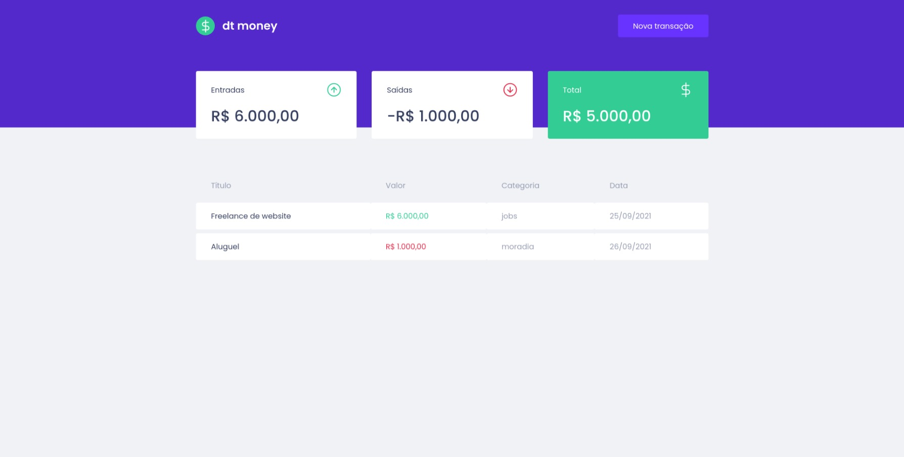
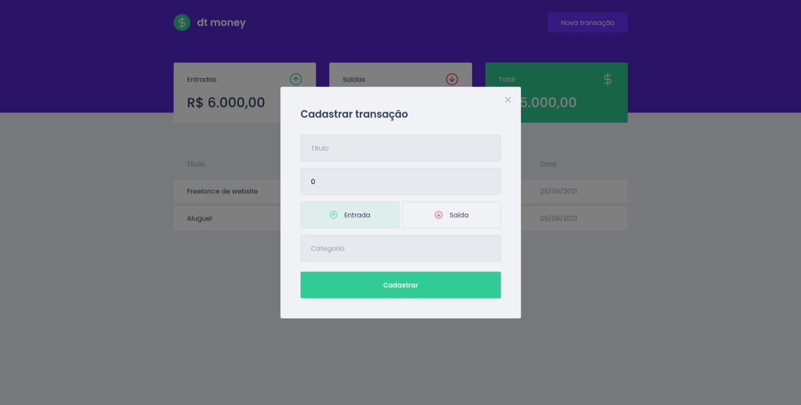

<div style="background-color: #5429cc; padding-top: 7px" align="center"></div>

<div>

  <h3 align="center">Projeto criado durante as aulas do capítulo 2 de React no programa Ignite da <a href="https://www.rocketseat.com.br">Rocketseat</a></h3>
  <p align="center">App com objetivo de organizar o orçamento mensal de pessoas desenvolvedoras</p>
  <br/>
</div>

---

## Prévia




---

## Tecnologias
### Esse projeto foi desenvolvido com as seguintes tecnologias:

- Typescript
- ReactJS
- Styled Components
- Context API
- MirageJS
- Axios

---

## Instalação
#### Esse projeto usa Node.js e Yarn
- clone o projeto:
  ```
  git clone https://github.com/paulopbomfim/estudos-dtmoney.git
  ```
- Entre na pasta do projeto usando o terminal e digite:
  ```
  yarn
  ```
- Em seguida digite:
  ```
  yarn start
  ```